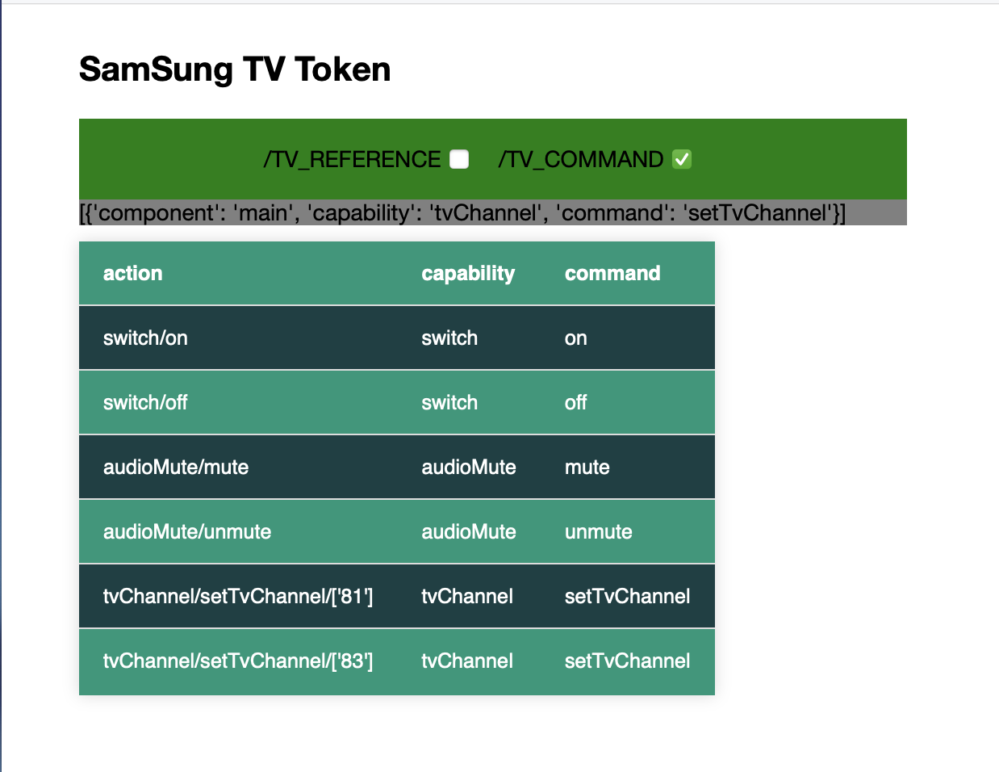

# ST-Device-with_Siri-main

---

Operates seamlessly with Samsung SmartThings and Apple HomeKit using shortcuts—no complex bridging necessary.

A. Access your Samsung TV's SmartThings functions from your iPhone, MacBook, or iPad.

B. Easily tap to power the Samsung TV on/off or select your desired channel.

C. Simply ask Siri to control your Samsung TV or other SmartThings-linked devices.

---

Procedure and Steps:

To control a Samsung device using these functions, you need to modify additional command shortcuts(such as "test device on") and implement a common API shortcut called "ST_Device_CMD_API."

Command shortcut will prepare JSON data and call API shortcut to post data to desired samsung device.

Before use of API shortcut, you need to edit 'pat' field with your personal access token(ID) for the ST_Device_CMD_API, go to smartthings page for Authorization and Permissions provided by https://developer.smartthings.com/docs/getting-started/authorization-and-permissions

Tips for using command shortcuts:

1. After download, unzip the archive and tap each Shortcut to add it to the Shortcut app where you can can edit and run the Shortcut.

2. Command shortcut contains json data like [{"component": "main","capability": "switch","command":"on"}].

3. Edit "cmdJSON" field in shortcut with more controls provided in file "ST_API.json" or running ST_Query.py.

4. You need to edit "deviceid" field in shortcut with device ID provided by https://my.smartthings.com/advanced
, and click into device page for all your devices on smartthings.

5. Use Siri to execute your Shortcuts by saying “Hey Siri Shortcut yourShortName” or “Hey Siri yourShortName”

6. Once you’ve created your Shortcuts, you can added them to your Home Screen as well as widget for execution. 

Good Luck and Enjoy!

